<div align="center">


# Bible & Hymns API

**The King James Bible and public-domain hymns as a free, fast JSON API — plus a website to read, search and sing.**

[**Website**](https://bible-hymns.emnextech.dev) ·
[**API explorer**](https://bible-hymns.emnextech.dev/#/api) ·
[**JSON index**](https://bible-hymns.emnextech.dev/v1) ·
[Endpoints](#endpoint-reference) ·
[Self-hosting](#run-it-yourself)


</div>


---

## Contents

- [What it is](#what-it-is)
- [Quick start](#quick-start)
- [Endpoint reference](#endpoint-reference)
  - [Bible](#bible)
  - [Hymns](#hymns)
  - [Search everything](#search-everything)
- [Bible references](#bible-references)
- [Errors, caching and limits](#errors-caching-and-limits)
- [Code examples](#code-examples)
- [The website](#the-website)
- [Run it yourself](#run-it-yourself)
- [Project structure](#project-structure)
- [Database](#database)
- [Adding hymns](#adding-hymns)
- [Content and licensing](#content-and-licensing)

---

## What it is

| | |
|---|---|
| **Bible** | King James Version (1769) — 66 books, 1,189 chapters, 31,102 verses |
| **Hymns** | 121 public-domain hymns, including a growing import of *Gospel Hymns Nos. 1 to 6* (1895) |
| **Search** | Full-text search (SQLite FTS5, stemmed, prefix matching) over verses and hymn lyrics |
| **References** | Understands `John 3:16`, `1 Jn 1:7-9`, `Gen 1:1-2:3`, `Ps 23`, `Jude 5`, and several at once |
| **Access** | `GET` only, JSON, no key, no sign-up, CORS enabled for any origin |
| **Base URL** | `https://bible-hymns.emnextech.dev` |

---

## Quick start

```bash
curl https://bible-hymns.emnextech.dev/v1/bible/kjv/john/3/16
```

```json
{
  "reference": "John 3:16",
  "translation": "kjv",
  "verses": [
    {
      "book": "John",
      "chapter": 3,
      "verse": 16,
      "reference": "John 3:16",
      "text": "For God so loved the world, that he gave his only begotten Son, that whosoever believeth in him should not perish, but have everlasting life."
    }
  ],
  "text": "For God so loved the world, that he gave his only begotten Son, that whosoever believeth in him should not perish, but have everlasting life."
}
```

From a browser or any JavaScript runtime:

```js
const API = "https://bible-hymns.emnextech.dev";

const verse = await fetch(`${API}/v1/bible/kjv/john/3/16`).then((r) => r.json());
console.log(verse.reference, verse.text);
```

> Try every endpoint live, with editable parameters, in the **[API explorer](https://bible-hymns.emnextech.dev/#/api)**.

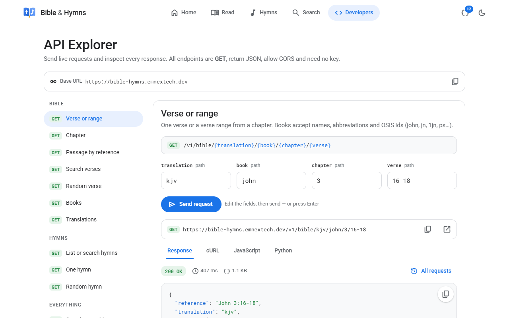

---

## Endpoint reference

All endpoints are `GET` and return `application/json`.
Long `text` values below are shortened with `…` for readability.

| Method | Path | Description |
|---|---|---|
| `GET` | [`/v1`](#get-v1) | Index of all endpoints |
| `GET` | [`/v1/translations`](#get-v1translations) | Available translations |
| `GET` | [`/v1/books`](#get-v1books) | The 66 books |
| `GET` | [`/v1/bible/{translation}/{book}/{chapter}`](#get-v1bibletranslationbookchapter) | A whole chapter |
| `GET` | [`/v1/bible/{translation}/{book}/{chapter}/{verse}`](#get-v1bibletranslationbookchapterverse) | A verse or verse range |
| `GET` | [`/v1/bible/{translation}/passage?ref=`](#get-v1bibletranslationpassage) | One or more references |
| `GET` | [`/v1/bible/{translation}/search?q=`](#get-v1bibletranslationsearch) | Full-text verse search |
| `GET` | [`/v1/bible/{translation}/random`](#get-v1bibletranslationrandom) | A random verse |
| `GET` | [`/v1/hymns`](#get-v1hymns) | List or search hymns |
| `GET` | [`/v1/hymns/{id}`](#get-v1hymnsid) | One hymn with verses and chorus |
| `GET` | [`/v1/hymns/random`](#get-v1hymnsrandom) | A random hymn |
| `GET` | [`/v1/search?q=`](#get-v1search) | Search the Bible and hymns at once |
| `GET` | [`/v1/export.json`](#get-v1exportjson) | Everything in one file, for offline apps |
| `GET` | [`/v1/export/version`](#get-v1exportversion) | Version of the export, to check for updates |

### General

#### `GET /v1`

Machine-readable list of endpoints, each with a working example path.

```json
{
  "name": "Bible & Hymns API",
  "version": "1.0.0",
  "endpoints": {
    "translations": "/v1/translations",
    "books": "/v1/books",
    "chapter": "/v1/bible/kjv/john/3",
    "verse": "/v1/bible/kjv/john/3/16",
    "verseRange": "/v1/bible/kjv/john/3/16-18",
    "passage": "/v1/bible/kjv/passage?ref=Gen 1:1-2:3; Ps 23",
    "search": "/v1/bible/kjv/search?q=only believe",
    "randomVerse": "/v1/bible/kjv/random",
    "hymns": "/v1/hymns",
    "hymnSearch": "/v1/hymns?q=blood",
    "hymn": "/v1/hymns/1",
    "randomHymn": "/v1/hymns/random",
    "searchAll": "/v1/search?q=grace"
  }
}
```

### Bible

#### `GET /v1/translations`

```json
{
  "translations": [
    { "id": "kjv", "name": "King James Version (1769)", "language": "en", "license": "Public Domain" }
  ]
}
```

Use the `id` (`kjv`) as `{translation}` in every Bible endpoint.

#### `GET /v1/books`

```json
{
  "books": [
    { "id": 1, "osis": "Gen", "name": "Genesis", "testament": "OT", "chapters": 50 },
    { "id": 2, "osis": "Exod", "name": "Exodus", "testament": "OT", "chapters": 40 },
    …
  ]
}
```

| Field | Meaning |
|---|---|
| `id` | Canonical position, 1–66 |
| `osis` | Standard OSIS abbreviation — usable as `{book}` (`gen`, `1john`, `ps`) |
| `testament` | `OT` or `NT` |
| `chapters` | Number of chapters |

#### `GET /v1/bible/{translation}/{book}/{chapter}`

A whole chapter, with links to the previous and next chapter (they cross book boundaries; `null` at Genesis 1 and Revelation 22).

```bash
curl https://bible-hymns.emnextech.dev/v1/bible/kjv/ps/23
```

```json
{
  "reference": "Psalms 23",
  "translation": "kjv",
  "verses": [
    { "book": "Psalms", "chapter": 23, "verse": 1, "reference": "Psalms 23:1", "text": "A Psalm of David. The Lord is my shepherd; I shall not want." },
    { "book": "Psalms", "chapter": 23, "verse": 2, "reference": "Psalms 23:2", "text": "He maketh me to lie down in green pastures: he leadeth me beside the still waters." },
    …
  ],
  "text": "A Psalm of David. The Lord is my shepherd; I shall not want. He maketh me to lie down in green pastures: …",
  "book": "Psalms",
  "chapter": 23,
  "previous": "/v1/bible/kjv/ps/22",
  "next": "/v1/bible/kjv/ps/24"
}
```

`{book}` accepts a full name, an abbreviation, an OSIS id or a number — see [Bible references](#bible-references).

#### `GET /v1/bible/{translation}/{book}/{chapter}/{verse}`

One verse (`16`) or a range (`16-18`).

```bash
curl https://bible-hymns.emnextech.dev/v1/bible/kjv/1jn/1/7-9
```

Response shape: `reference`, `translation`, `verses[]` and `text` (all verse texts joined with spaces) — the same as the [quick start](#quick-start) example.

#### `GET /v1/bible/{translation}/passage`

| Query | Required | Description |
|---|---|---|
| `ref` | yes | One or more references separated by `;` (max 10) |

```bash
curl "https://bible-hymns.emnextech.dev/v1/bible/kjv/passage?ref=John%203:16;%20Jude%2024-25"
```

```json
{
  "translation": "kjv",
  "passages": [
    {
      "reference": "John 3:16",
      "translation": "kjv",
      "verses": [ { "book": "John", "chapter": 3, "verse": 16, "reference": "John 3:16", "text": "For God so loved the world, …" } ],
      "text": "For God so loved the world, …"
    },
    {
      "reference": "Jude 1:24-25",
      "translation": "kjv",
      "verses": [
        { "book": "Jude", "chapter": 1, "verse": 24, "reference": "Jude 1:24", "text": "Now unto him that is able to keep you from falling, …" },
        { "book": "Jude", "chapter": 1, "verse": 25, "reference": "Jude 1:25", "text": "To the only wise God our Saviour, …" }
      ],
      "text": "Now unto him that is able to keep you from falling, …"
    }
  ]
}
```

#### `GET /v1/bible/{translation}/search`

| Query | Required | Default | Description |
|---|---|---|---|
| `q` | yes | | Words to find. Every word must match; each word matches as a prefix and is stemmed (`believ` finds *believe*, *believeth*, *believed*) |
| `book` | no | | Limit to one book (`mark`, `Hebrews`, `1jn`) |
| `limit` | no | `20` | 1–100 |
| `offset` | no | `0` | For paging |

Results are ranked by relevance (BM25).

```bash
curl "https://bible-hymns.emnextech.dev/v1/bible/kjv/search?q=only%20believe&limit=2"
```

```json
{
  "query": "only believe",
  "translation": "kjv",
  "total": 7,
  "limit": 2,
  "offset": 0,
  "results": [
    { "book": "John", "chapter": 3, "verse": 18, "reference": "John 3:18", "text": "He that believeth on him is not condemned: …" },
    { "book": "Luke", "chapter": 8, "verse": 50, "reference": "Luke 8:50", "text": "But when Jesus heard it, he answered him, saying, Fear not: believe only, …" }
  ]
}
```

#### `GET /v1/bible/{translation}/random`

A random verse — useful for a "verse of the day" widget. Never cached.

```json
{
  "translation": "kjv",
  "book": "Acts",
  "chapter": 5,
  "verse": 40,
  "reference": "Acts 5:40",
  "text": "And to him they agreed: …"
}
```

### Hymns

#### `GET /v1/hymns`

Without `q`: every hymn, ordered by id. With `q`: full-text search over title, author, source and lyrics.

| Query | Required | Default | Description |
|---|---|---|---|
| `q` | no | | Search words (same rules as verse search) |
| `limit` | no | `50` | 1–100 |
| `offset` | no | `0` | For paging |

```bash
curl "https://bible-hymns.emnextech.dev/v1/hymns?limit=2"
```

```json
{
  "total": 121,
  "limit": 2,
  "offset": 0,
  "hymns": [
    {
      "id": 1,
      "title": "Only Believe",
      "first_line": "Fear not, little flock, from the cross to the throne",
      "author": "Paul Rader",
      "year": 1921,
      "copyright": "Public Domain",
      "scripture": "Mark 5:36",
      "source": null,
      "source_number": null
    },
    …
  ]
}
```

With a search, each result also has `match` — a snippet where matched words are wrapped in `[` `]`:

```bash
curl "https://bible-hymns.emnextech.dev/v1/hymns?q=lower%20lights"
```

```json
{
  "query": "lower lights",
  "limit": 50,
  "offset": 0,
  "results": [
    {
      "id": 67,
      "title": "Brightly beams our Father's mercy",
      "first_line": "Brightly beams our Father's mercy",
      "author": null,
      "year": null,
      "copyright": "Public Domain",
      "scripture": null,
      "source": "Gospel Hymns Nos. 1 to 6 (1895)",
      "source_number": 45,
      "match": "…Let the [lower] [lights] be burning!\nSend a gleam across the wave…"
    }
  ]
}
```

| Field | Meaning |
|---|---|
| `id` | Hymn id used by `/v1/hymns/{id}` |
| `title` | Title (for hymns imported from a words-only hymnal this is the first line) |
| `author`, `year` | When known |
| `copyright` | Always `Public Domain` for the bundled hymns |
| `scripture` | A related Bible reference — pass it straight to `/passage?ref=` |
| `source`, `source_number` | The printed hymnal the text came from and its number there |

#### `GET /v1/hymns/{id}`

A hymn split into parts and lines, ready to render or project.

```bash
curl https://bible-hymns.emnextech.dev/v1/hymns/67
```

```json
{
  "id": 67,
  "title": "Brightly beams our Father's mercy",
  "first_line": "Brightly beams our Father's mercy",
  "author": null,
  "year": null,
  "copyright": "Public Domain",
  "scripture": null,
  "source": "Gospel Hymns Nos. 1 to 6 (1895)",
  "source_number": 45,
  "parts": [
    {
      "kind": "verse",
      "number": 1,
      "lines": ["Brightly beams our Father's mercy", "From His light-house evermore;", "But to us He gives the keeping", "Of the lights along the shore."]
    },
    {
      "kind": "chorus",
      "number": null,
      "lines": ["Let the lower lights be burning!", "Send a gleam across the wave!", "Some poor fainting, struggling seaman", "You may rescue, you may save."]
    },
    …
  ]
}
```

`parts` are in printed order. The chorus is printed once; when singing, it is normally repeated after every verse. (A few hymns have a different final chorus — those contain more than one `chorus` part.)

#### `GET /v1/hymns/random`

Same shape as `/v1/hymns/{id}`. Never cached.

### Search everything

#### `GET /v1/search`

Searches verses and hymns in one call. If `q` is a Bible reference, the passage is returned in `reference` too.

| Query | Required | Default | Description |
|---|---|---|---|
| `q` | yes | | Words or a reference |
| `translation` | no | `kjv` | Translation for verses and the reference |

```bash
curl "https://bible-hymns.emnextech.dev/v1/search?q=Romans%208:28"
```

```json
{
  "query": "Romans 8:28",
  "reference": {
    "reference": "Romans 8:28",
    "translation": "kjv",
    "verses": [ { "book": "Romans", "chapter": 8, "verse": 28, "reference": "Romans 8:28", "text": "And we know that all things work together for good to them that love God, …" } ],
    "text": "And we know that all things work together for good to them that love God, …"
  },
  "verses": [],
  "hymns": []
}
```

`verses` holds up to 10 matching verses and `hymns` up to 10 matching hymns (with `match` snippets); `reference` is `null` when `q` is not a reference.

### Offline export

For apps that must work without internet (mobile apps, church projector software). Download everything once, store it, and check for updates now and then.

#### `GET /v1/export.json`

The whole Bible and every hymn in a single file: about **4.2 MB**, **~1.2 MB over the network** (served compressed from Cloudflare's edge). `/v1/export` redirects here.

```json
{
  "format": "bible-hymns-export",
  "format_version": 1,
  "version": "97ede3c62ecf",
  "generated_at": "2026-10-08T08:03:46.618Z",
  "counts": { "verses": 31102, "hymns": 121 },
  "translations": [ { "id": "kjv", "name": "King James Version (1769)", "language": "en", "license": "Public Domain" } ],
  "books": [ { "id": 1, "osis": "Gen", "name": "Genesis", "testament": "OT", "chapters": 50 }, … ],
  "bible": {
    "kjv": [
      [ ["In the beginning God created the heaven and the earth.", "And the earth was without form, …", …], … ],
      …
    ]
  },
  "hymns": [
    { "id": 1, "title": "Only Believe", "author": "Paul Rader", "year": 1921, "copyright": "Public Domain", "scripture": "Mark 5:36",
      "source": null, "source_number": null, "parts": [ { "kind": "verse", "number": 1, "lines": ["Fear not, little flock, …", …] }, … ] },
    …
  ]
}
```

The Bible is nested by position, so a verse is a direct lookup:

```js
const text = data.bible.kjv[book - 1][chapter - 1][verse - 1];
data.bible.kjv[42][2][15]; // John 3:16
```

`hymns` have the same shape as [`/v1/hymns/{id}`](#get-v1hymnsid).

#### `GET /v1/export/version`

Tiny response (cached for 5 minutes) to check whether your stored copy is current:

```json
{
  "version": "97ede3c62ecf",
  "generated_at": "2026-10-08T08:03:46.618Z",
  "counts": { "verses": 31102, "hymns": 121 },
  "url": "/v1/export.json"
}
```

`version` is a hash of the content: it changes only when the content changes, e.g. when hymns are added.

```js
const API = "https://bible-hymns.emnextech.dev";

async function syncOffline(store) {
  const { version } = await fetch(`${API}/v1/export/version`).then((r) => r.json());
  if (version !== store.get("version")) {
    const data = await fetch(`${API}/v1/export.json`).then((r) => r.json());
    store.set("data", data);
    store.set("version", data.version);
  }
  return store.get("data");
}
```

---

## Bible references

The same parser powers `{book}` path segments, `?ref=` and `/v1/search`.

**Books** — case-insensitive, dots and spaces ignored:

| You can write | Resolves to |
|---|---|
| `John`, `jn`, `jhn`, `43` | John |
| `1 John`, `I John`, `First John`, `1jn`, `1john` | 1 John |
| `Ps`, `Psalm`, `Psalms`, `psa` | Psalms |
| `Song of Songs`, `sos`, `canticles` | Song of Solomon |
| `Rev`, `Revelation`, `Revelations` | Revelation |
| a unique prefix: `deut`, `phil`, `hab` | Deuteronomy, Philippians, Habakkuk |

Ambiguous prefixes such as `jo` (Job? Joel? John? Jonah?) are rejected.

**Shapes:**

| Reference | Meaning |
|---|---|
| `John 3:16` | one verse |
| `John 3:16-18` | verse range |
| `Gen 1:1-2:3` | range across chapters |
| `Ps 23` | whole chapter |
| `Ps 23-24` | chapter range |
| `Jude 5`, `Jude 3-5` | single-chapter books take bare verse numbers |
| `Genesis` | a book name alone means chapter 1 |
| `John 3:16; Rom 10:9-10` | several references (passage endpoint) |

`John 3.16` (dot instead of colon) and `Rom8:28` (no space) also work.

---

## Errors, caching and limits

Errors use HTTP status codes and a JSON body with an `error` message:

| Status | When | Example body |
|---|---|---|
| `400` | Bad reference, unknown book or translation, missing `q` | `{"error":"John has 21 chapter(s); got 22"}` |
| `404` | Unknown hymn or route | `{"error":"Hymn not found"}` |
| `500` | Unexpected server error | `{"error":"Internal server error"}` |

- **CORS:** `Access-Control-Allow-Origin: *` — call it directly from browser code.
- **Caching:** successful `GET` responses send `Cache-Control: public, max-age=86400`; `random` endpoints are not cached.
- **Limits:** no key and no hard rate limit. Please cache on your side and keep `limit` reasonable. Abusive traffic may be blocked by Cloudflare.
- **Versioning:** all paths are under `/v1`; breaking changes will go to `/v2`.

---

## Code examples

<details open>
<summary><b>JavaScript / TypeScript</b></summary>

```js
const API = "https://bible-hymns.emnextech.dev";

async function get(path) {
  const res = await fetch(API + path);
  const body = await res.json();
  if (!res.ok) throw new Error(body.error);
  return body;
}

// A chapter, then the next one
const ps23 = await get("/v1/bible/kjv/ps/23");
ps23.verses.forEach((v) => console.log(v.verse, v.text));
const ps24 = await get(ps23.next);

// Several references at once
const { passages } = await get("/v1/bible/kjv/passage?ref=" + encodeURIComponent("John 3:16; Rom 8:28"));

// Search verses, page 2
const page2 = await get("/v1/bible/kjv/search?q=faith&limit=20&offset=20");

// A hymn, verse by verse with the chorus repeated
const hymn = await get("/v1/hymns/1");
const chorus = hymn.parts.find((p) => p.kind === "chorus");
for (const part of hymn.parts.filter((p) => p.kind === "verse")) {
  console.log(part.lines.join("\n"));
  if (chorus) console.log(chorus.lines.join("\n"));
}
```

</details>

<details>
<summary><b>Python</b></summary>

```python
import requests

API = "https://bible-hymns.emnextech.dev"

verse = requests.get(f"{API}/v1/bible/kjv/john/3/16").json()
print(verse["reference"], verse["text"])

results = requests.get(f"{API}/v1/bible/kjv/search", params={"q": "faith", "book": "hebrews", "limit": 5}).json()
for v in results["results"]:
    print(v["reference"], "-", v["text"])

hymns = requests.get(f"{API}/v1/hymns", params={"q": "blood"}).json()
for h in hymns["results"]:
    print(h["id"], h["title"])
```

</details>

<details>
<summary><b>cURL</b></summary>

```bash
curl "https://bible-hymns.emnextech.dev/v1/bible/kjv/john/3/16-18"
curl "https://bible-hymns.emnextech.dev/v1/bible/kjv/passage?ref=Gen%201:1-2:3"
curl "https://bible-hymns.emnextech.dev/v1/bible/kjv/search?q=only%20believe&book=mark"
curl "https://bible-hymns.emnextech.dev/v1/hymns?q=blood%20of%20the%20lamb"
curl "https://bible-hymns.emnextech.dev/v1/search?q=grace"
```

</details>

<details>
<summary><b>Dart / Flutter</b></summary>

```dart
import 'dart:convert';
import 'package:http/http.dart' as http;

const api = 'https://bible-hymns.emnextech.dev';

Future<Map<String, dynamic>> getVerse(String book, int chapter, String verse) async {
  final res = await http.get(Uri.parse('$api/v1/bible/kjv/$book/$chapter/$verse'));
  final body = jsonDecode(res.body) as Map<String, dynamic>;
  if (res.statusCode != 200) throw Exception(body['error']);
  return body;
}
```

</details>

<details>
<summary><b>Kotlin (Android)</b></summary>

```kotlin
val client = OkHttpClient()
val request = Request.Builder()
    .url("https://bible-hymns.emnextech.dev/v1/hymns/1")
    .build()
client.newCall(request).execute().use { res ->
    val json = JSONObject(res.body!!.string())
    println(json.getString("title"))
}
```

</details>

---

## The website

The site at [bible-hymns.emnextech.dev](https://bible-hymns.emnextech.dev) is built entirely on this API. It is a single dependency-free page served by the same Worker.

| | |
|---|---|
| 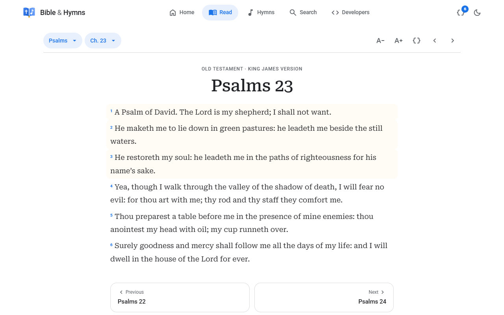 | 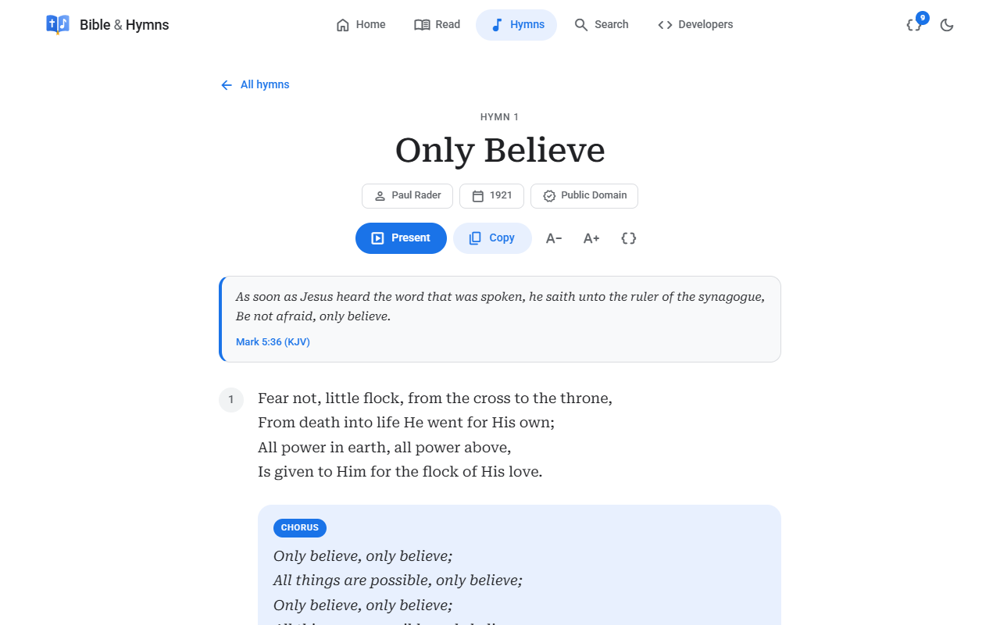 |
| **Reader** — book & chapter picker, tap verses to copy or share, text size, ←/→ keys | **Hymn** — verses, chorus, the linked scripture, copy, text size |
| 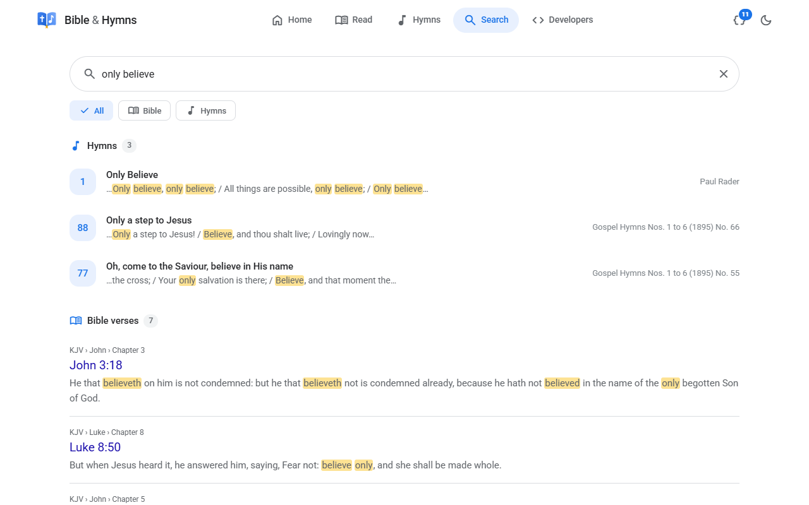 | 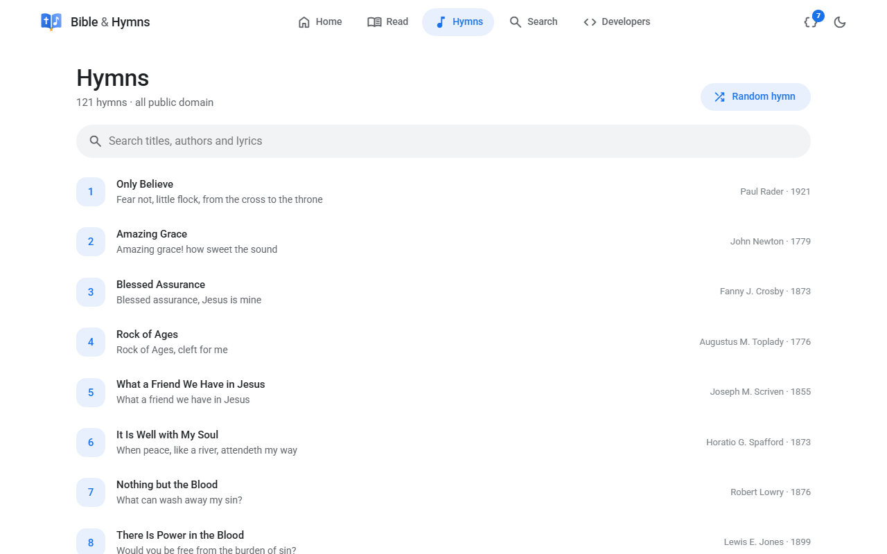 |
| **Search** — passages, hymns and verses together, with highlights and filters | **Hymn list** — live search over titles and lyrics |
| 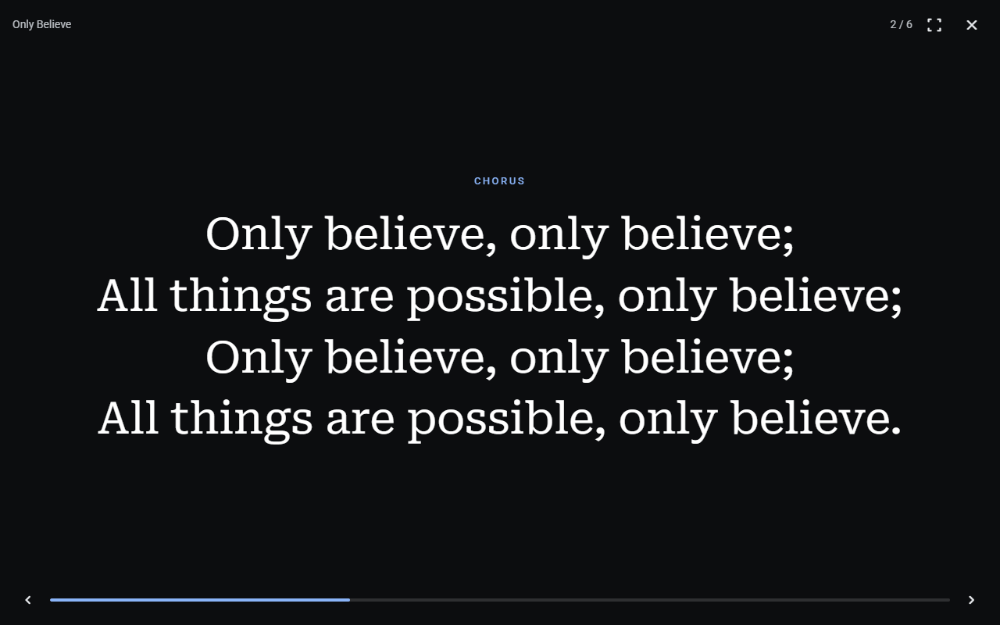 | 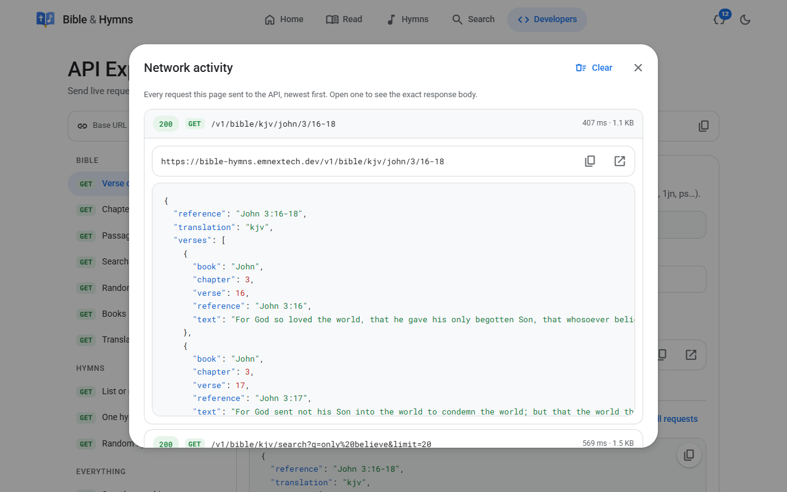 |
| **Present mode** — full-screen projector view, the chorus repeats after each verse | **Network inspector** — every API request the page makes, with its JSON |

**Dark mode**


**On phones**

| | | | |
|---|---|---|---|
| 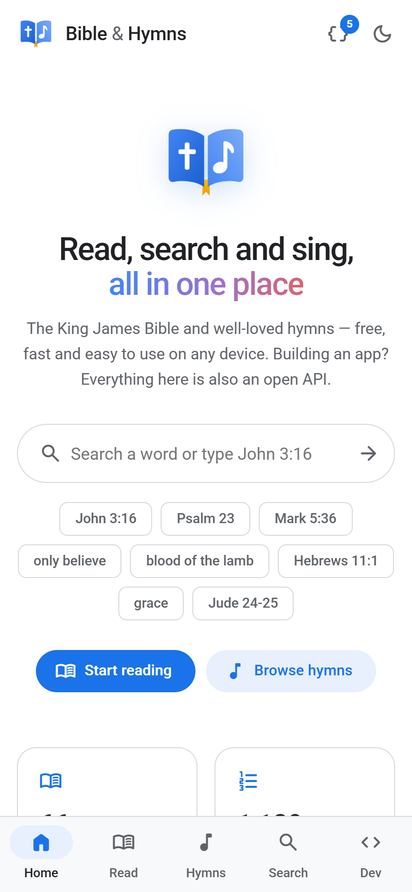 | 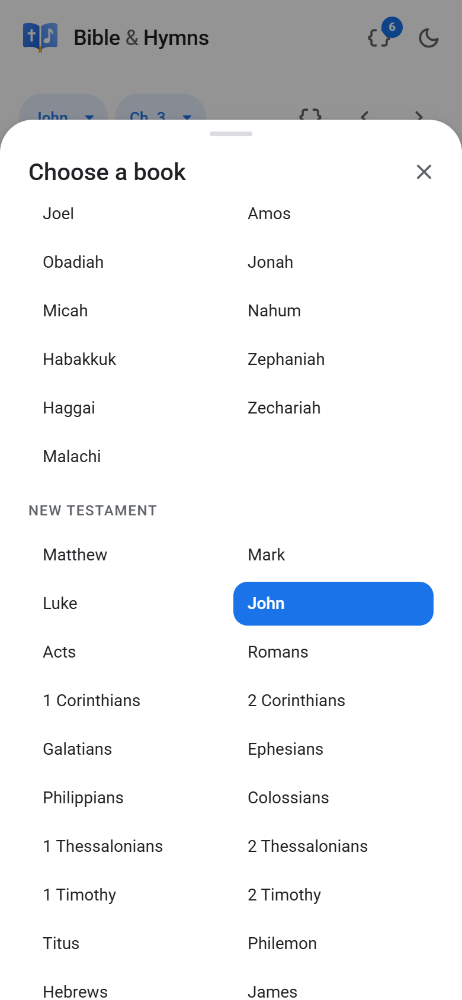 | 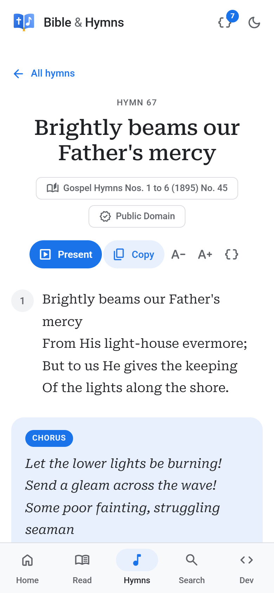 | 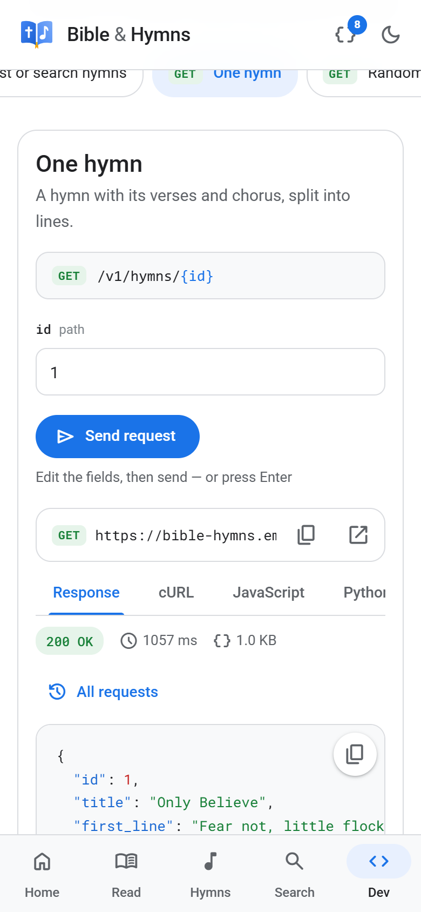 |

Highlights:

- Works on old and new browsers: the page is compiled to ES2017 with CSS fallbacks (iOS 11+, Chrome 58+, Firefox 52+, Samsung Internet 7+), and very old browsers get a friendly message instead of a blank screen.
- About 27 KB compressed; the icon font is self-hosted and subset to the 49 icons in use (~9 KB).
- Respects *reduce motion* (fades instead of slides) while keeping loaders and feedback.
- Installable on phones (web app manifest, home-screen icons).
- Routes live in the URL hash, so every page can be bookmarked or shared: `#/read/john/3?v=16`, `#/hymns/1`, `#/search?q=grace`, `#/api/passage`.

---

## Run it yourself

### Requirements

- Node.js 20+
- A free Cloudflare account (only to deploy)

### Local development

```bash
git clone https://github.com/emnextech/Bible-Hymns.git
cd Bible-Hymns
npm install

npm run fetch:kjv      # download the KJV text into data/raw/kjv.json
npm run seed:build     # build data/seed.sql and public/v1/export.json from the KJV and data/hymns/*.json
npm run db:local       # create the schema and load the seed into a local D1 database
npm run dev            # build the website and start http://localhost:8787
```

Open `http://localhost:8787` for the website and `http://localhost:8787/v1` for the API.

### Deploy to Cloudflare

```bash
npx wrangler login
npx wrangler d1 create bible-hymns
```

Put the printed `database_id` (and your `account_id`) into `wrangler.jsonc`. Remove or change the `routes` entry — it points at this project's custom domain. Then:

```bash
npm run db:remote      # load schema + data into the remote D1 database
npm run deploy         # build the website and deploy the Worker
```

Everything fits in Cloudflare's free tier: the database is about 8 MB and the API only reads.

### Scripts

| Script | What it does |
|---|---|
| `npm run dev` | Build the website, run the Worker locally |
| `npm run deploy` | Build the website, deploy to Cloudflare |
| `npm test` | Unit tests for the reference parser (Vitest) |
| `npm run typecheck` | TypeScript check |
| `npm run fetch:kjv` | Download the KJV JSON |
| `npm run seed:build` | Generate `data/seed.sql` and the offline export `public/v1/export.json` |
| `npm run db:local` / `db:remote` | Load schema + seed into local / remote D1 |
| `npm run build:web` | Compile `web/index.html` → `public/index.html` |
| `npm run hymns:fetch` | Download the hymnal scans (see [Adding hymns](#adding-hymns)) |
| `npm run hymns:segment` | Split the scans into individual hymns |
| `npm run hymns:build` | Turn cleaned transcriptions into hymn JSON and verify them |

---

## Project structure

```
├── src/
│   ├── index.ts            Worker: Hono routes for /v1/*
│   ├── books.ts            The 66 books, aliases and name lookup
│   └── reference.ts        Bible reference parser ("1 Jn 1:7-9", "Gen 1:1-2:3")
├── test/
│   └── reference.test.ts   Parser tests
├── web/
│   └── index.html          Website source (one file: HTML, CSS, JS)
├── public/                 Static files served at /
│   ├── index.html          ← generated by `npm run build:web`, do not edit
│   ├── brand/              Logo, favicons, app icons, social preview image
│   ├── fonts/              Self-hosted, subset icon font
│   └── manifest.webmanifest
├── data/
│   ├── hymns/              Hymn JSON loaded into the database
│   ├── hymns-src/          Cleaned hymnal transcriptions (input to hymns:build)
│   └── raw/                Downloads (KJV JSON, hymnal scans) — not committed
├── scripts/
│   ├── build-seed.mjs      KJV + hymns → data/seed.sql
│   ├── build-web.mjs       web/index.html → public/index.html (ES2017, minified)
│   └── hymnal/             fetch-scans, segment, build (hymnal import pipeline)
├── docs/screenshots/       Images used in this README
├── schema.sql              D1 / SQLite schema
└── wrangler.jsonc          Worker, D1 binding, assets and custom domain
```

**Stack:** [Hono](https://hono.dev) on Cloudflare Workers, Cloudflare D1 (SQLite + FTS5), static assets served by the same Worker, TypeScript, Vitest, esbuild.

---

## Database

```sql
translations (id TEXT PK, name, language, license)
books        (id INTEGER PK, osis, name, testament, chapters)
verses       (rowid PK, translation, vid, book, chapter, verse, text)   -- UNIQUE (translation, vid)
verses_fts   FTS5 over verses.text   (porter stemming, unicode61)
hymns        (id INTEGER PK, title, first_line, author, year, copyright, scripture, source, source_number)
hymn_parts   (hymn_id, position, kind 'verse'|'chorus', number, text)
hymns_fts    FTS5 over title, author (+ source), lyrics
```

Every verse has a numeric id `vid = book × 1,000,000 + chapter × 1,000 + verse` (John 3:16 → `43003016`). Any reference becomes a single range query, `WHERE vid BETWEEN start AND end`, so whole chapters, cross-chapter ranges and chapter ranges are all one indexed lookup.

---

## Adding hymns

### By hand

Add a JSON file to `data/hymns/` (every `*.json` file there is loaded):

```json
[
  {
    "id": 900,
    "title": "Hymn Title",
    "author": "Author Name",
    "year": 1890,
    "copyright": "Public Domain",
    "scripture": "John 3:16",
    "parts": [
      { "kind": "verse", "text": "Line one\nLine two" },
      { "kind": "chorus", "text": "Chorus line one\nChorus line two" }
    ]
  }
]
```

Then `npm run seed:build` and `npm run db:local` (or `db:remote`).

Ids must be unique. Ids 1–22 are the hand-entered starter set; ids from 23 up are `22 + number` in *Gospel Hymns Nos. 1 to 6*.

### From a printed hymnal

*Gospel Hymns Nos. 1 to 6* (1895, 739 hymns) is imported in reviewed batches:

1. `npm run hymns:fetch` downloads two independent OCR scans from the Internet Archive.
2. `npm run hymns:segment` splits each scan into its 739 hymns, using the printed hymn numbers and the book's first-line index for numbers the OCR lost.
3. Each batch is transcribed into `data/hymns-src/gospel-hymns/NNN-NNN.txt`:

   ```
   ## 45
   Brightly beams our Father's mercy
   From His light-house evermore;
   ...

   [C]
   Let the lower lights be burning!
   ...
   ```

   `## n` starts hymn *n*, a blank line separates parts, `[C]` marks a chorus and an optional `# Title` line overrides the first-line title.

4. `npm run hymns:build` writes `data/hymns/gospel-hymns-1895.json` and **verifies every word against both scans**, flagging words that do not appear in the source and hymns whose lines may be missing. Hymns that duplicate the starter set are skipped.

---

## Content and licensing

| Content | Source | Status |
|---|---|---|
| King James Version (1769) | [scrollmapper/bible_databases](https://github.com/scrollmapper/bible_databases) | Public domain |
| *Gospel Hymns Nos. 1 to 6* (1895) | Internet Archive scans [`gospelhymnsnos1t00sank`](https://archive.org/details/gospelhymnsnos1t00sank) and [`gospelhymnsnos1t00mcgr`](https://archive.org/details/gospelhymnsnos1t00mcgr) | Public domain (published 1895) |
| Starter hymns (ids 1–22) | Classic hymns written 1772–1921 | Public domain |

Only public-domain texts are included. Modern Bible translations and modern hymns are copyrighted and need a licence from their publishers before they can be added.

The hymn transcriptions follow the 1895 wording and spelling (*Saviour*, *to-day*), which sometimes differs from modern hymnbooks.

---

<div align="center">
<sub>Built by <a href="https://github.com/emnextech">emnextech</a> · Bible &amp; Hymns</sub>
</div>
